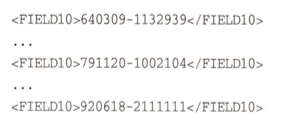

# 제목 없음

## 3장. 기본적인 도구

- 자신만의 기본적인 훌륭한 도구를 갖추자

### 14. 일반 텍스트의 힘

- 지식을 일반 텍스트로 저장하라.
- 일반 텍스트 아래와 같은 이점이 있다.
    - 구식이 되는 것에 대한 보험
    - 호환성
    - 더 쉬운 테스트
    - 최소 공통분모 (= 표준)

특수한 포맷의 텍스트

일반 텍스트

### 15. 조개 놀이

- GUI는 보이는 대로 사용할 수 있다는 장점이 있지만, 반대로 보이는 것만 사용할 수 있다는 단점이 있기도 하다.
- 명령어 셸의 힘을 사용하라.
- 셸에 익숙해지면 생산성이 급상승하는 걸 알게 될 것이다.

### 16. 파워 에디팅

- 텍스트가 프로그래밍의 기본적인 원재료이기 때문에, 가능하면 텍스트를 별로 힘들이지 않고 조작하고 싶어 한다.
- 하나의 에디터를 잘 사용하라.
    - 에디터 하나를 골라서 완전히 마스터하고, 모든 편집 작업에 그 에디터를 사용하라.

### 17. 소스코드 관리

- 언제나 소스코드 관리 시스템을 사용하라.
- 전체 프로젝트를 소스코드 관리를 하게 되면, 제품 빌드가 자동화되고, 그것을 반복할 수 있게된다.

### 18. 디버깅

- 비난 대신 문제를 해결하라
- 가장 속이기 쉬운 사람은 자기 자신이다. - 에드워드 불워-리톤
- 디버깅을 할 때 당황하지 마라.
- 버그가 났을 때 “왜 이렇지?”라고 생각하며 에너지를 1도 낭비하지 말고, 그냥 고쳐야지 라고 생각하고 받아들여라
- 경계 조건과 실제 최종사용자 사용 패턴 모두를 철저히 테스트해야 한다. 이걸 체계적으로 할 필요가 있다
- 164 고무 오리를 두고 고무 오리에게 설명한다는 생각으로 디버깅을 해라.
- 164 우선 모든 문제를 본인의 코드 부터 의심해야 한다.
- ‘select’는 망가지지 않았다.
- 166 만약 탐색을 시작할 만한 위치를 모르겠다면 이진탐색과 같이 접근하여 문제의 범위를 좁혀나갈 수 있다.
- 167 버그가 의심되는 부분은 항상 가정하지 말고, 증명하라
- 167 버그가 났다면, 단순히 그것을 고치는 것을 넘어서, 왜 이 실패가 더 일찍 발견되지 않았을까 생각해야 한다.
    - 단위 테스트 및 다른 테스트 수정
    - 매개 변수 검사를 좀 더 낮게 하여 (일찍 작동을 멈추기, 단정문)
    - 다시 발생 시에 그 사실을 알 수 있도록 해야함.
    - 버그 개선에 시간이 더 오래 걸린다면, 회고하고 다음에는 이 버그를 좀 더 쉽게 고칠 수 있도록 노력하라.
    - 다른 팀원의 잘못된 가정의 결과라면 이 문제를 전체 팀과 함께 토론하라.
    - 그래서 다음번에는 놀라지 않게 하라.

### 19. 텍스트 처리

- 170 텍스트 처리 언어를 하나 익혀라.
- 170 각 언어별 생산성을 비교한 논문. 재미있겠는데?

### 20. 코드 생성기

- 175 언제 코드 생성기를 활용하면 좋을까 주변에서 생각하고 적용해보자
- 179 만약 코드 생성기로 코드를 생성한다면 언어 중립적인 표현에서 생성해내면 좋다. 입력 파일을 분석하는 부분이 작아지면서 프로그램이 간단해지기 때문이다.

## 4장. 실용주의 편집증

- 181 완벽한 소프트웨어는 만들 수 없다.
- 183 Paranoia is knowing all the facts. - Woody Allen

### 21. 계약에 의한 설계

- 184 상식과 정직만큼 사람을 놀라게 하는 건 없다. - 랄프 왈도 에머슨
- 186 만약 호출자가 루틴의 모든 선생조건을 충족한다면, 해당 루틴은 종료시 모든 후행조건과 불변식이 참이 될 것을 보증해야 한다.
- 187 계약에 따른 설계를 하라.
- 191 자바의 경우 iContract라는 단정 로직이 포함된 새로운 소스 파일을 생성해주는 라이브러리가 있다.
- 193 선행조건은 호출자가 책임지고 검증해야한다. 호출 전에 처리를 해야한다는 뜻이다.
- 194 고정 불변의 법칙인 요구사항과 새로운 경영진에 의해 얼마든지 바뀔 수 있는 단순한 정책을 혼동하지 말아야 한다. 우리가 의미론적 불변식이라는 용어를 사용하는 것은 이 때문이다. 불변식은 어떤 것의 바로 그 의미의 중심이 되어야 하며, 일시적인 정책(좀 더 동적인 비즈니스 법칙)에 영향을 받으면 안된다.
- 195 의미론적 불변조건의 예시
    - 오류 발생시 소비자의 입장을 우선하라
    - 사용자의 계좌에 동일 트랜젝션이 절대 2번 일어나면 안된다.
- 196 DBC가 널리 쓰이지 않는 이유는 무엇인지 조사해보기
- 196 연습문제를 실제로 풀어봐야 DBC에 대하여 더욱 감이 잡힐 것 같다.

### 22. 죽은 프로그램은 거짓말을 하지 않는다.

- 200 일찍 작동을 멈추게 하라.
- 201 방금 불가능한 뭔가가 발생했다는 것을 코드가 발견한다면, 프로그램은 더 이상 유효하지 않다고 할 수 있다. 이 시점 이후로 하는 일은 모두 수상 쩍은 게 된다. 되도록 빨리 종료해야 할 일이다. 일반적으로, 죽은 프로그램이 입히는 피해는 절름발이 프로그램이 끼치는 것보다 훨씬 덜한 법이다.

### 23. 단정적 프로그래밍

- 202 자기 비난에는 사치성이 있다. 우리가 자신을 비난할 때, 다른 사람은 우리를 비난할 권리가 없다고 우리는 느낀다. - 오스카 와일드
- 202 단정문을 사용해서 불가능한 상황을 예방하라.
- 203 진짜 에러처리 대신으로 단정문을 사용하지는 마라. 단정문은 결코 일어나면 안되는 것들을 검사한다.
- 204 첫째 방어선은 모든 가능한 에러를 체크하는 것이고, 둘째는 놓친 것들을 잡아내기 위해 단정문을 쓰는 것이다.
- 204 프로그램을 출시할 때 단정 기능을 꺼버리는 것은, 공중 곡예를 하면서 연습으로 한 번 건너봤다고 그물 없이 건너는 것과 비슷하다. 극적인 가치야 있겠지만 생명보험을 들기는 어렵다.
- 205 디버깅 행위가 디버깅되는 시스템의 행동을 바꿔버리는, 일종의 ‘하이젠버그’적인 문제다.
- 206 불가능한 것들 중 무엇이 실제로 일어날 수 있는지 연습문제 한번 풀어보기!

### 24. 언제 예외를 사용할까

- 208 예외는 의외의 상황을 위해 남겨두어야 한다. 잡히지 않은 예외는 프로그램을 종료시킬 것이라고 가정하고, ‘모든 예외 처리기를 제거해도 이 코드가 여전히 실행될까?’라고 자문해보자. 만약 그 답이 ‘아니오’라면 아마도 예외가 비예외적인 상황에서 사용되고 있는 것이다.
- 210 예외는 예외적인 문제에 사용하라.
- 211 언제 예외를 사용해야하지? 연습문제 풀어보기

### 25. 리소스 사용의 균형

- 212 시작한 것은 끝내라
- 216 리소스를 할당한 순서의 반대로 해제하라.
- 216 코드 여러 곳에서 동일한 리소스 집합을 할당하는 경우, 할당 순서를 언제나 같게 하라. 교착 가능성이 줄어들 것이다.

## 5장. 구부러지거나 부러지거나

- 226 ‘세상 돌아가는 대로 돌아가는’ 코드

### 26. 결합도 줄이기와 디미터 법칙

- 모듈간의 결합도를 최소화하라.
- 디미터 함수 법칙

### 27. 메타프로그래밍

- 통합하지 말고 설정하라.
- 코드에는 추상화를, 메타데이터에는 세부 내용을.
- 메타데이터 주도 애플리케이션의 이점들
    - 설계의 결합도를 줄여 좀 더 유연하고 적응성 있는 프로그램을 만들 수 있다.
    - 세부사항을 코드 밖으로 몰아냄으로써 보다 강하고 추상적인 디자인을 만들 수 있다.
    - 애플리케이션을 커스터마이징하기 위해 다시 컴파일할 필요가 없다. 이런 방식의 커스터마이징을 통해 실제 제작 공정 시스템에서 일어날 수 있는 치명적인 버그에서 벗어나는 우회로를 쉽게 만들 수 있다.
    - 메타데이터는 범용 프로그래밍 언어보다 문제 도메인에 가까운 방식으로 표현될 수 있다.
    - 동일한 애플리케이션 엔진과 상이한 메타데이터를 이용해 여러 다른 프로젝트를 진행할 수 있다.

### 28. 시간적 결합

- 작업흐름 분석을 통해 동시성을 개선하라.

동시성을 활용한 칵테일 제조과정

- 컴포넌트 대신 서비스를 사용해서 설계하라.
    - 잘 정의되고 일관성 있는 인터페이스 뒤에서 일하는 독립적이고 동시적인 객체들 만들기 위해서.
- 언제나 동시성을 고려해 설계하라.

동시성을 고려하지 않고 설계되어 의도치 않게 동작할 수 있다.

동시성을 고려한 자바 설계

### 29. 단지 뷰일 뿐이야

- 모델에서 뷰를 분리하라.

### 30. 칠판

- 칠판을 사용해 작업흐름을 조율하라.
- 여러명이 칠판에 무언가를 쓰면서 논의 하는 것과 같이 동시성/비동기성을 생각해서 설계하라는 뜻인가…?
- 제대로 이해를 못함….