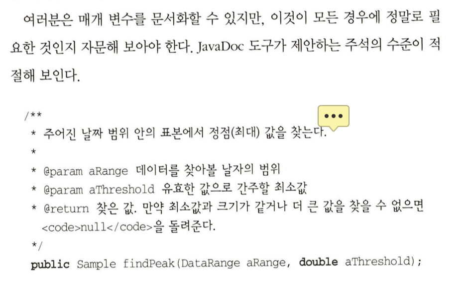

## 6장. 코딩하는 동안 해야 할 일들

### 31. 우연에 맡기는 프로그래밍

- 279 실제로 어떤 우연들이 있는지 확인해봐야 겠다

### 32. 알고리즘의 속도

- 287 함수의 재귀호출 == 무서운 내부 반복문?들이 있는지 확인해봐야겠다.

### 34. 테스트하기 쉬운 코드

- 305 회귀 테스트 준비가 리펙토링의 시작
- 312 소프트웨어를 테스트하라. 그렇지 않으면 사용자가 테스트하게 될 것이다.

### 35. 사악한 마법사

- 314 실제로 무슨 코드인지 이해 못하고 배포하는 경우가 많은지? 그리고 코드베이스에서 어디까지 알아야 할까?

## 7장. 프로젝트 전에

### 36. 요구사항의 구렁텅이

- 319 완성이라는 것은 더 이상 더할 것이 없는게 아니라, 더 이상 빼낼 것이 없을 때 얻게 되는 것이다. - 생텍쥐페리, 바람과 모래와 별들 (1939)
    - 이 문장이 처음에 여기서 나왔구나…!
- 319 요구사항을 수집하지 말고 채굴하라.
    - 격공… 요구사항은 채굴해아 한다… 기획자가 어디까지 되는지? 안되는지 모르다 보니 요청하지 않았던 경우가 많았던 것 같다.
- 320 정책은 수시로 바뀐다. 따라서 요구사항 속에 그걸 고정하는 건 그리 좋은 생각이 아니다.
    - 요구사항과 정책은 다르다. 정책이 앞으로 자주 변경될 수 있다.면 따로 분리해두어야 한다.
- 321 요구사항, 정책, 구현 간을 구분해야겟다.
- 321 사용자들이 어떤 작업을 현재 어떻게 하느냐는 것을 알아내는 것보다, 왜 그걸 하는지 그 내제적 이유를 알아내는 것이 더 중요하다.
- 322 사용자처럼 생각하기 위해 사용자와 함께 일하라
- 327 요구사항은 아키텍처가 아니다. 요구사항은 설계가 아니며, 사용자 인터페이스도 아니다. 요구사항은 필요다.
    - 요구사항은 딱 필요한 만큼 구체화 되야 한다. 꼭 복잡한 틀로 표현하기 보다도.
- 329 구체적인 것보다 추상적인 것이 더 오래간다.

### 38. 준비가 되어야만

- 340 약간 냉소적으로 들릴지 모르지만, 그냥 시작해도 되겠다는 느낌이 안들어 라고 생각하기 보다 프로토타입 작업이라도 시작하는 것이 정치적으로 더욱 용인되는 행동일 것이다.
    - 정말 라이트하게 만들어 보면서 생각 및 일정 구체화에 큰 도움이 되는 것 같다.

### 39. 명세의 함정

- 342 신발끈을 리본 모양으로 매는 방법을 설명하는 짧은 글을 하나 써보라.
    - 와… 진짜 어려운데…?
- 343 어떤 일들은 설명하기보다 실제로 하는 것이 쉽다.

### 40. 동그라미와 화살표

- 349 비싼 도구가 더 좋은 설계를 낳지는 않는다.
    - 개인적으로 RestDocs를 사용하지 않은 이유
- 350 Q. 순전히 소통비용이 높을 뿐인데 이러한 부분을 도구 탓을 해본적은 없는지? 그리고 새로운 도구를 도입하는 방식으로 해결한 적이 있는지?

## 8. 실용주의 프로젝트

### 41. 실용주의 팀

- 355 팀 내에 일관된 소통 (문서) 기준이 필요하다.
- 355 팀이 하나로서 의사소통하게 도와주는 간단한 마케팅 비결이 있다. 프로젝트를 시작할 때 이름을 지어주는 것이다. 유별난 이름이라면 더 좋겠다.
    - 프로젝트에 애칭을 지어 정체성과 애정을 부여하라
- 356 어떤 팀은 팀원 한 명을 프로젝트 사서로 임명하여 문서와 코드 저장소를 관리하는 책무를 맡긴다.
    - 팀 문서화 총괄 책임자가 필요한 것 같다.

### 43. 가차 없는 테스트

- 380 파괴자를 써서 테스트를 테스트하라.
    - mutation test가 그것에 예시가 될 수 있을까?
- 382 코드 커버리지보다 상태 커버리지를 테스트하라.
- 383 버그는 한 번만 잡아라
    - 버그가 생기면 테스트에 추가하라는 뜻

### 44. 결국은 모두 글쓰기

- 387 코드를 쓰기보다 읽기 편하게 작성하라
    - 구글 엔지니어는 이렇게 일한다와 똑같은 이야기
- 388 코드 내 주석에서 나와야 할 것과 나오지 말아야 할 것들
  
    
    
    나와야 할 정보들의 예시. 여기 저자의 이름 또한 포함
    
    - 나오지 말아야 할 것들
        - 파일 내 코드가 export하는 함수들의 목록
        - 리비전 기록
        - 이 파일이 사용하는 파일 목록
        - 파일 이름
- 393 코드를 다룰 때와 똑같은 관심을 문서화에도 주어야 한다.
    - 구글 엔지니어는 이렇게 일한다와 같이 프로젝트 단계에 문서화 단계를 통합 시키자

### 45. 위대한 유산

- 395 사용자의 기대를 부드럽게 넘어서라.
- 397 만약 사용자와 가깝게, 그들의 기대를 공유하고 여러분이 하는 일에 대해 그들과 소통하면서 작업을 했다면, 프로젝트가 끝나고 산출물이 전달되었을 때 놀랄만한 일은 거의 없을 것이다.
    - 사용자와 평소 지속적으로 소통하며 개발해라.

### 46. 오만과 편견

- 399 자신의 작품에 서명하라
- 400 우리는 소유권에 대한 긍지를 보고 싶다. “내가 이걸 만들었고, 내 작품의 품질을 보증합니다.” 여러분의 서명이 품질의 보증수표로 인식되게 해야 한다. 사람들이 코드에 붙여진 여러분의 이름을 보고 그것이 튼튼하고 잘 작성되고 제대로 테스트되었으며 또 훌륭히 문서화되었을 것이라고 기대하도록 만들자.